# SPARK V1 Architecture Audit

This document presents a comprehensive audit of the Spark V1 firmware, identifying tight coupling, scalability bottlenecks, memory concerns, and technical debt, and detailing the refactoring opportunities.

---

## 1. Current Folder Structure

```
DESKIMON/
├── CMakeLists.txt              # Root build file
├── sdkconfig                   # Project configuration
├── main/                       # Main application folder
│   ├── main.c                  # Entry point (initializes drivers, starts tasks)
│   ├── LVGL_UI/
│   │   ├── deskimon.c          # UI logic, eye states, IMU/touch triggers, animation helpers
│   │   └── deskimon.h
│   ├── MIC_Driver/
│   │   ├── MIC_Speech.c        # AFE wake word / MultiNet engine, record task, conversation state
│   │   └── MIC_Speech.h
│   ├── Cloud/
│   │   ├── Cloud.c             # Supabase WebSocket client, diagnostics reporting, settings syncing
│   │   ├── Cloud_Upload.c      # Voice query uploads (Supabase block & direct Voice REST API)
│   │   └── Cloud.h
│   ├── Provisioning/
│   │   ├── Provisioning.c      # WiFi & ID credentials storage and local AP portal
│   │   └── Provisioning.h
│   └── [Drivers]/              # I2C, EXIO, BAT, Touch, LCD, Audio (PCM5101), RTC, IMU, SD
└── components/                 # Precompiled submodules (LVGL, ESP-DSP, Audio Player, etc.)
```

---

## 2. Dependency Graph (Firmware Layer)

```mermaid
graph TD
    Main[main.c] -->|Calls| DisplayInit[LCD_Init / LVGL_Init]
    Main -->|Calls| Drivers[I2C / EXIO / RTC / IMU / Battery / Power Key]
    Main -->|Calls| AudioInit[Audio_Init / MIC_Speech_init]
    Main -->|Calls| UIStart[Deskimon_Start]
    
    MIC_Speech[MIC_Speech.c] -->|Direct Call| UI_SetEmotion[Deskimon_SetEmotion]
    MIC_Speech -->|Spawns Task| Cloud_UploadDirect[Cloud_UploadVoiceDirect]
    
    Cloud_Upload[Cloud_Upload_Upload.c] -->|Direct Call| UI_SetEmotion
    Cloud_Upload -->|Direct Call| AudioPlay[Play_Music_From_Buffer]
    
    Cloud[Cloud.c] -->|Direct Call| UI_SetEyeColor[Deskimon_SetEyeColor]
    Cloud -->|Direct Call| UI_SetEmotion
    Cloud -->|Direct Call| AudioPlay
    
    UI_deskimon[deskimon.c] -->|Direct Read| IMU[QMI8658 Accel Data]
    UI_deskimon -->|Direct Call| Recording[MIC_StartRecordingManual]
    UI_deskimon -->|Direct Style Modifications| LVGL[LVGL Objects / Custom Masks]
```



---

## 3. Major Modules & Roles

1. **Firmware Orchestrator (`main.c`):** Handles boot-up sequence, hardware initialization, and spawns driver and LVGL timer loops.
2. **Visual Face Engine (`deskimon.c`):** Renders eyes, eyelids, mouths, tears, and custom visual overlays using LVGL 8 primitive components. It also drives the autonomous look-around animation, handles touch events, detects long presses, and manages local face transitions (`eye_state_t`).
3. **Voice AFE & Spotter (`MIC_Speech.c`):** Manages the dual-microphone recording buffers, runs the Espressif AFE (Audio Front End) and MultiNet custom command spotter, detects silence thresholds (VAD), and drives the conversational state machine (`conv_state_t`).
4. **Cloud Communications Service (`Cloud.c` / `Cloud_Upload.c`):** Executes WAV uploads, handles HTTP post-query responses containing TTS audio, runs the background database syncing via WebSocket, and reports diagnostic telemetry.

---

## 4. Architectural Vulnerabilities

### Tight Coupling Issues
- **Scattered State Logic:** The conversation state (`conv_state_t`) is owned by `MIC_Speech.c`, while the visual face state (`eye_state_t`) is owned by `deskimon.c`. They synchronize by making direct, asynchronous function calls (e.g. `Deskimon_SetEmotion("listening")`). There is no centralized system coordinator.
- **Sensor Leakage in UI Core:** `deskimon.c` directly calls `getAccelerometer()` and reads the global `Accel` structure. Graphic rendering code should never query low-level I2C bus registers directly.
- **Asynchronous Callback Violations:** When the screen is tapped or swiped, the touch event handler `screen_event_cb` in `deskimon.c` directly triggers recording states by calling `MIC_StartRecordingManual()`, creating circular dependency paths.

### Scalability Bottlenecks
- **Hardcoded Faces:** Visual expressions are defined as a giant switch-case statement inside `set_eyes_state(eye_state_t new_state)`. Expanding to 100+ expressions would make this file excessively long and difficult to maintain.
- **Coupled Animations:** Animations (e.g., blink, expand wtf, shake) are created inline with `anim_prop()`. There is no central registry where these behaviors can be parameterized and dynamically reused across multiple faces.
- **Static Assets Configuration:** Visual assets, eye dimensions, mask angles, and positions are compiled directly into binary code. This prevents the implementation of dynamic themes, asset packs, or local OTA face updates.

### Memory & Performance Concerns
- **High CPU Overhead of Custom Drawing:** Custom LVGL drawing masks (`happy_mouth_mask_event_cb`, `wtf_mouth_mask_event_cb`, and `eye_mask_event_cb`) are invoked every frame for the mouth shapes. Stacking multiple masks degrades performance and causes stutter.
- **I2C Bus Contention:** Reading the accelerometer inside `deskimon.c`'s 100ms timer task generates high traffic on the shared I2C bus, potentially colliding with RTC or EXIO updates.
- **Heap Fragmentation Risks:** Audio payloads are downloaded directly to SPIRAM buffers (`s_mp3_play_buf` in `Cloud.c`). If the pointer tracking is lost during multiple concurrent speech queries, it causes severe heap leaks on the ESP32-S3.

---

## 5. Refactor Opportunities

1. **Introduce Spark Core Managers:** Group code into separate, distinct managers: State, Hardware, Face, Animation, Emotion, and Intent.
2. **Centralize the State Machine:** Migrate the conversational and visual states into a centralized state coordinator (`spark_state`).
3. **Decouple Hardware Drivers:** Abstract IMU, Touch, RTC, and Battery behind a unified hardware client (`spark_hardware`) that publishes events (shakes, swipes, battery updates) using callback registers.
4. **Make Faces Data-Driven:** Restructure faces into static struct definitions mapping eye, mouth, and tear attributes. The Face Manager will interpret these structs, eliminating the massive switch-case blocks.
5. **Establish Animation Registry:** Abstract blinking, shaking, and morphing into reusable parameterized animator modules.
